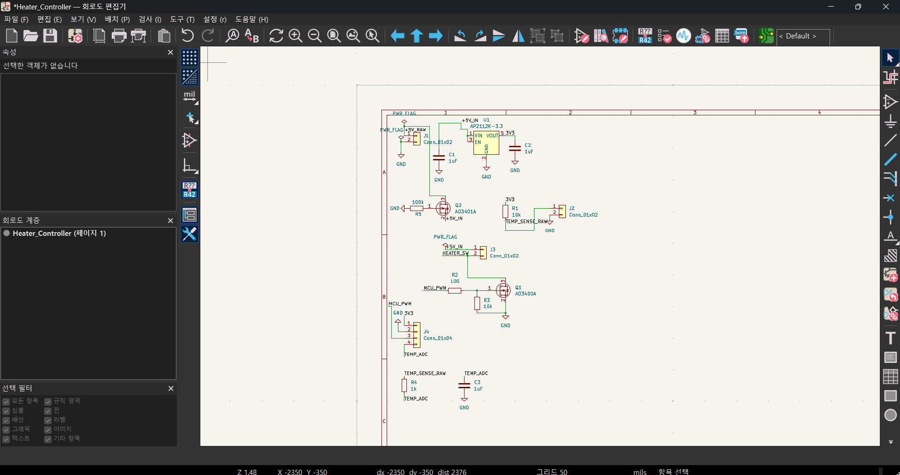
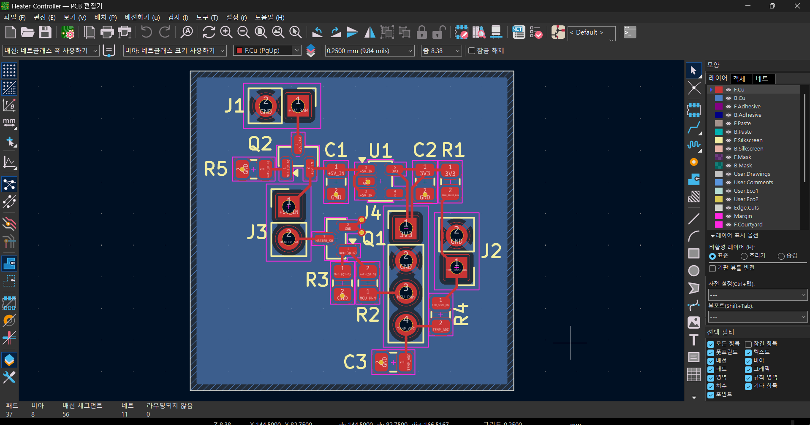
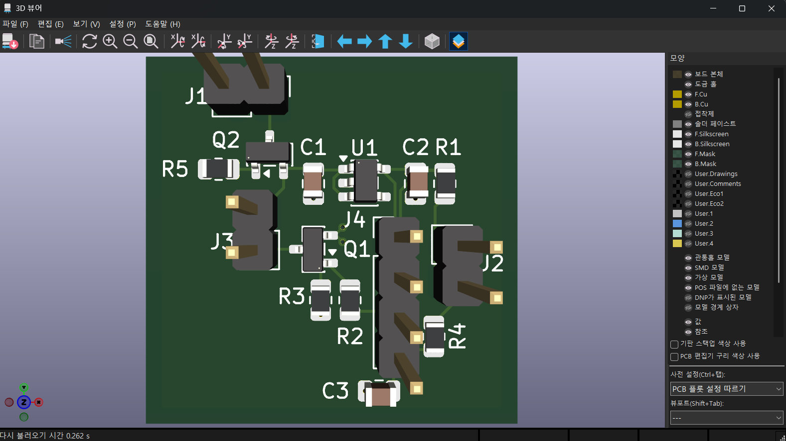

# MCU Heater Controller PCB

NTC 온도센서 피드백을 기반으로 MCU가 히터를 제어하도록 설계한
2-layer PCB 프로젝트입니다.

MCU의 PWM 신호로 N-channel MOSFET을 구동하여 5 V 히터를 제어하고,
NTC 센서의 아날로그 출력 전압을 MCU ADC로 전달하도록
Schematic 및 PCB Layout을 설계했습니다.

## System Overview

- Heater Supply: 5 V
- Heater Load: 10 Ω
- Calculated Heater Current: 0.5 A
- MCU Logic Level: 3.3 V
- Heater Switching: N-channel MOSFET
- Temperature Sensing: NTC voltage-divider based ADC input
- PCB: 2-layer
- Design Tool: KiCad

## Schematic

회로는 **전원부, 히터 구동부, 온도 센싱부, MCU 인터페이스**로 구성했습니다.

- 5 V 입력으로부터 3.3 V 전원 생성
- MCU_PWM 신호를 이용한 MOSFET gate 제어
- N-channel MOSFET을 이용한 heater low-side switching
- NTC 센서 신호를 TEMP_ADC로 전달
- MOSFET gate resistor 및 pull-down resistor 적용
- 전원 안정화를 위한 decoupling capacitor 적용

## PCB Layout

PCB Layout에서는 히터 스위칭부와 온도 센싱부 사이의 간섭 가능성을 줄이고,
전원 및 신호 경로를 단순화하는 방향으로 부품을 배치하고 배선했습니다.

주요 Layout 고려사항은 다음과 같습니다.

- HEATER_SW 전류 경로 최소화
- MOSFET과 heater connector 간 배선 최소화
- MCU_PWM과 TEMP_ADC 신호 경로 분리
- Switching section과 sensor section 간 물리적 거리 확보
- Ground return path를 고려한 부품 배치
- 2-layer PCB를 활용한 routing 구성

실제 노이즈 계측이나 SI/EMI 해석을 수행한 것은 아니며,
스위칭 회로와 아날로그 센싱 회로의 특성을 고려하여
배치 및 배선 단계에서 간섭 가능성을 줄이는 방향으로 설계했습니다.

## 3D View

PCB Layout 완료 후 KiCad 3D Viewer를 이용하여

- 부품 배치
- Connector 방향
- Board outline
- 기본적인 부품 간 배치 간섭 여부

를 확인했습니다.

## Design Process

1. Heater 및 NTC sensor 요구사항 정의
2. Datasheet 기반 MOSFET 및 주요 부품 선정
3. Schematic 작성 및 회로 연결 검토
4. Footprint 설정 및 PCB 부품 배치
5. Power / sensor signal routing
6. Ground return path 및 switching noise 가능성을 고려한 Layout 검토
7. 3D View를 이용한 최종 배치 및 형상 확인

## Design Considerations

### MOSFET Switching

3.3 V MCU PWM 신호로 5 V heater load를 제어하기 위해
N-channel MOSFET 기반 low-side switching 구조를 적용했습니다.

Gate 입력에는 resistor와 pull-down resistor를 구성하여
MCU 출력과 MOSFET gate 사이의 인터페이스를 구성했습니다.

### Temperature Sensing

NTC 센서의 저항 변화를 전압으로 변환하여
MCU ADC에서 읽을 수 있도록 voltage-divider 기반 센싱 회로를 구성했습니다.

TEMP_ADC 신호가 heater switching node와 불필요하게 인접하지 않도록
PCB 배치와 routing을 검토했습니다.

### Power and Signal Separation

Heater switching path와 temperature sensing path의 역할이 다르다고 판단하여
PCB 상에서 전력부와 센서부를 가능한 한 분리하여 배치했습니다.

특히 HEATER_SW 경로는 짧게 구성하고,
MCU_PWM 및 TEMP_ADC 신호가 서로 불필요하게 교차하지 않도록 routing했습니다.

## Design Files

- `Heater_Controller.kicad_pro`
- `Heater_Controller.kicad_sch`
- `Heater_Controller.kicad_pcb`

KiCad에서 직접 열어 Schematic과 PCB Layout을 확인할 수 있습니다.

## Project Status

완료한 범위:

- Schematic 설계
- Datasheet 기반 주요 부품 선정
- Footprint 설정
- PCB 부품 배치
- 2-layer Routing
- Ground 및 signal routing 검토
- 3D View를 통한 배치 확인
